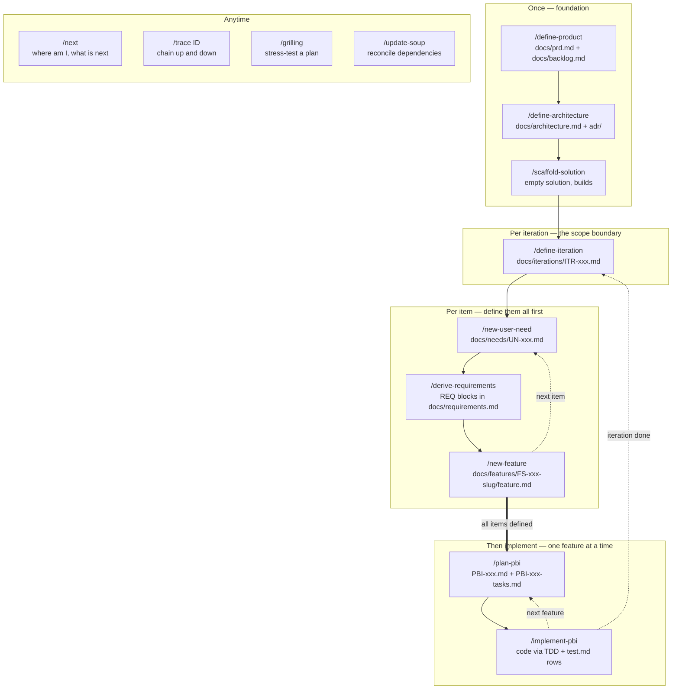
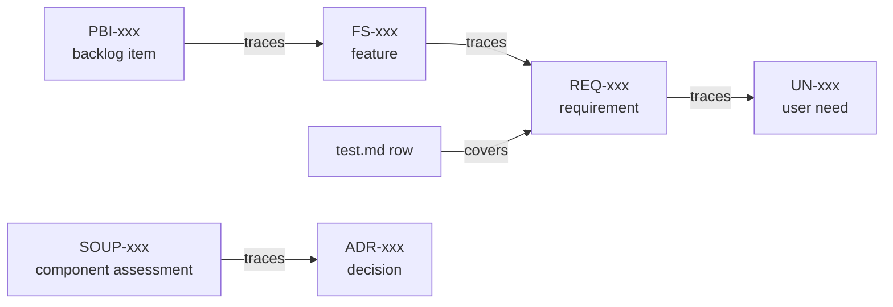

# FOW — Feature Oriented Workflow with AI

Iterative, human-led development workflow for new products. Feature oriented: each increment runs need -> requirements -> feature -> PBI -> code. Compact docs with hard size caps, full ID traceability, AI-assisted via skills.

**No big upfront spec — but the spec does get big.** `docs/prd.md` starts as a short statement of problem, users and goals, and stays that size. Everything else grows around it, one user need at a time: each need adds requirements, a feature spec, PBIs and test rows. Over a product's life that body of documentation becomes large and detailed. It just never gets written all at once, and never ahead of a real need.

**Iterations bound the scope.** `/define-iteration` is a short list, not an interview: name the needs and features you want this round, nothing more. FOW then defines every item in that list before writing any code, and implements one feature at a time.

## Flow



Text form: `/define-product -> /define-architecture -> /scaffold-solution` once. Then per iteration: `/define-iteration`, then `/new-user-need -> /derive-requirements -> /new-feature` for every item in it, then `/plan-pbi -> /implement-pbi` one feature at a time.

Every skill drafts one artifact, stops, and asks: **approve / refine / stop**. You approve; nothing advances without your OK. No status changes itself. Resume any session with `/next`.

## Traceability

Every artifact declares its parent in frontmatter `traces:`. Children point up, so the chain is never hand-kept — it is derived by scanning.



Run `/trace REQ-003` to walk it in either direction, or `/trace orphans` to find artifacts with no parent and requirements with no test.

## Regulated products
`prd.md` records device status and IEC 62304 safety class at stage 1. That selects the SOUP assessment form for every third-party component the product explicitly adds — full for class B/C components that can contribute to a hazardous situation, short otherwise. Runtime and shared-framework packages are exempt, covered by the Platforms & targets ADR.

`/update-soup` reconciles: it diffs the dependency manifest against `docs/soup/`, then adds missing assessments, amends drifted ones, and supersedes those whose package is gone. It fills the factual sections and leaves safety judgment — impact, risk, controls, residual risk, conclusion — deliberately empty, because a plausible auto-drafted safety analysis is more dangerous than a blank one. No gate blocks on it; `/next` reports what is outstanding.

## Install
Copy FOW into new product repo root (Git Bash):
```
cp -r .fow .claude FOW.md AGENTS.md CLAUDE.md "c:\path\to\new-repo"/
```
`docs/` is not copied — the skills create it as output.

Works with any AI agent. Claude Code picks up the skills natively; every other agent reads AGENTS.md.

## Contents
- FOW.md — canonical rules: stages, gates, IDs, statuses, style
- AGENTS.md — router: tells any agent which skill file to read for which trigger
- docs/ — every artifact FOW produces, in the *product* repo, for humans to read and approve: prd.md, backlog.md, architecture.md, adr/, iterations/, needs/, requirements.md, features/FS-xxx-slug/, soup/. This repo has no docs/ — the skills create it there.
- .fow/ — workflow internals. Not intended to be read or edited by hand
  - .fow/skills/ — 13 canonical skills: one per stage + next + trace + grilling + update-soup. Edit here
  - .fow/templates/ — 14 templates (prd, backlog, architecture, adr, iteration, user-need, requirements, feature, pbi, tasks, test, soup-full, soup-short, soup-index)
  - .fow/bin/sync-stubs.py — regenerates the Claude Code stubs from the canonical skills
- .claude/skills/ — generated pointer stubs so Claude Code auto-discovers the skills. Do not edit

## Maintaining the kit
Edit skills in `.fow/skills/`. The stubs in `.claude/skills/` copy each skill's `description`, which is what Claude Code triggers on, so editing a description without regenerating leaves Claude matching stale text:
```
python .fow/bin/sync-stubs.py           # regenerate
python .fow/bin/sync-stubs.py --check   # report drift, write nothing, exit 1 if any
```
Line endings are pinned to LF for the whole kit by `.gitattributes`, so stub comparison and `--check` behave the same on Windows, Linux and macOS. That file is deliberately *not* in the install payload — copying it into a product repo would renormalize that repo's files too.

`--check` is what to wire into CI or a pre-commit hook. It also reports orphaned stubs whose canonical skill was deleted, and refuses to remove anything that is not a generated stub.
